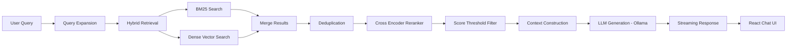

Hybrid RAG Assistant

A Hybrid Retrieval-Augmented Generation (RAG) document question-answering system that allows users to upload documents and ask questions about them.

The system retrieves relevant document chunks using hybrid search (BM25 + dense vectors) and generates answers using a local LLM via Ollama, while providing full visibility into the retrieval pipeline through a RAG debug panel.

This project demonstrates a full-stack AI system combining modern LLM orchestration with a real-time frontend interface.

Features
Hybrid Retrieval

Combines:

BM25 lexical search

Dense vector similarity search

This improves retrieval accuracy when documents do not match the query wording exactly.

Query Expansion

Before retrieval, the system generates multiple expanded queries using the LLM.

Example:

User Query:
Explain program counter

Expanded Queries:
1. What is the current value of the program counter?
2. How does the program counter affect program execution?
3. What happens when the program counter reaches the end of a program?

Cross-Encoder Reranking

Retrieved chunks are reranked using a cross-encoder model to improve semantic relevance before passing them to the LLM.

Hallucination Guard

Low confidence retrieval results are filtered using a score threshold to reduce hallucinated responses.

Streaming Responses

LLM responses are streamed token-by-token to the frontend for a real-time chat experience.

Document Management

Users can:

Upload documents

Remove documents

Ask questions across the uploaded corpus

Source Citations

Each answer displays the retrieved document chunks and relevance scores used for generation.

RAG Debug Panel

The debug panel exposes internal pipeline information including:

Retrieval Stats

Retrieved: 5
After rerank: 1

Performance Metrics

Retrieval: 61 ms
Rerank: 93 ms
Generation: 23 ms
Top Score: 1.799

Expanded Queries

1. What is the current value of the program counter?
2. How does the program counter affect program execution?
3. What happens when the program counter reaches the end of the program?

It also displays:

Retrieved documents

Reranked documents

This makes the system transparent and easier to debug.

RAG Pipeline Architecture


After pushing to GitHub this will render as a diagram.

Tech Stack
Backend

Python

FastAPI

LangChain

Ollama (local LLM)

rank-bm25

Dense vector embeddings

Cross-encoder reranker

Frontend

React

TypeScript

TailwindCSS

Project Structure


```
hybrid-rag-project
│
├── backend
│   │
│   ├── app.py
│   ├── requirements.txt
│   |
│   │
│   ├── core
│   │   ├── config.py
│   │   ├── evaluation.py
│   │   ├── ingestion.py
│   │   ├── memory.py
│   │   ├── reranker.py
│   │   ├── retriever.py
│   │   └── vector_store.py
│   │
│   ├── services
│   │   └── pipeline.py
│   │
│   └── data
│
├── frontend
│   │
│   ├── public
│   │
│   ├── src
│   │   │
│   │   ├── assets
│   │   │
│   │   ├── components
│   │   │   ├── ChatBox.tsx
│   │   │   ├── DebugPanel.tsx
│   │   │   ├── MessageBubble.tsx
│   │   │   └── SourceDocs.tsx
│   │   │
│   │   ├── services
│   │   │   └── api.ts
│   │   │
│   │   ├── types
│   │   │   └── types.ts
│   │   │
│   │   ├── App.tsx
│   │   ├── main.tsx
│   │   ├── App.css
│   │   └── index.css
│   │
│   ├── index.html
│   ├── package.json
│   ├── package-lock.json
│   │
│   ├── tailwind.config.js
│   ├── postcss.config.js
│   ├── vite.config.ts
│   │
│   ├── tsconfig.json
│   ├── tsconfig.app.json
│   ├── tsconfig.node.json
│   │
│   ├── eslint.config.js
│   └── .gitignore
│
├── README.md
└── .gitignore
```


Backend

The backend implements the Hybrid RAG pipeline using FastAPI.

Key modules:
ingestion.py → document loading and chunking
retriever.py → hybrid retrieval (BM25 + vector search)
reranker.py → cross-encoder reranking
vector_store.py → dense embedding storage
pipeline.py → orchestration of the RAG workflow
memory.py → conversational memory support

Frontend
The frontend is built using React + TypeScript + TailwindCSS (Vite).

Key components:
ChatBox.tsx → main chat interface
MessageBubble.tsx → renders chat messages
SourceDocs.tsx → shows retrieved document sources
DebugPanel.tsx → displays RAG pipeline internals

Setup Instructions
Prerequisites

Python 3.9+

Node.js 18+

Ollama installed
Pull a model:
ollama pull mistral

Backend Setup
cd backend
python -m venv venv
venv/scripts/activate

Install dependencies:-
pip install -r requirements.txt

Run the server:-
uvicorn app:app --reload

Backend runs at:-
http://localhost:8000

Frontend Setup
cd frontend
npm install
npm run dev

Frontend runs at:-
http://localhost:5173

Example Workflow
Upload a document
Ask a question
Query expansion generates alternative queries
Hybrid retrieval finds relevant chunks
Cross-encoder reranks the results
Context is constructed
LLM generates an answer
The response streams to the UI
Debug panel displays pipeline information


Future Improvements
Possible enhancements:
Better document chunking strategies
Metadata filtering 
RAG evaluation metrics
Docker deployment
Authentication
Multi-modal document support (images)
