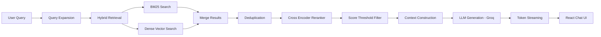

# Hybrid RAG Assistant


A full-stack Retrieval-Augmented Generation (RAG) system that allows users to upload documents and ask questions about them.
The system retrieves relevant document chunks using hybrid search (BM25 + dense vectors) and generates answers using a Groq-hosted LLM with real-time token streaming.
It also provides a debug panel exposing the internal RAG pipeline, enabling transparency into retrieval, reranking, and generation.

This project demonstrates how modern AI systems combine information retrieval + LLMs + real-time frontend streaming.

## Demo Capabilities
The system supports:
Document upload(Up to 2 documents and file types are *.txt and *.pdf)
Conversational Q&A over documents
Hybrid search retrieval
Query expansion
Cross-encoder reranking
Token-level streaming responses
Source citations
RAG pipeline observability

# Core Features
Hybrid Retrieval
The retriever combines two complementary approaches:
### BM25 (Lexical Search):-
Finds documents with exact keyword matches.

### Dense Vector Search:-
Dense vector search is implemented using FAISS, a high-performance library for efficient similarity search over embeddings.

Combining both improves retrieval when queries use different wording than the document.

## Query Expansion
Before retrieval, the system generates multiple reformulated queries using the LLM.

## Example:-

User Query:
```
Explain the program counter
```
Expanded Queries:-
```
What is the function of the program counter?
How does the program counter affect instruction execution?
What happens when the program counter updates?
```
This improves recall during retrieval.

## Cross-Encoder Reranking
Initial retrieval results are reranked using a cross-encoder model.

Cross-encoders evaluate:-
(query, document)
pairs together, producing more accurate relevance scores compared to vector similarity.

## Hallucination Guard
Low-confidence results are filtered using a score threshold before being passed to the LLM.
This reduces the likelihood of hallucinated answers.

## Streaming Responses
The backend streams tokens from the LLM to the frontend in real time.
This provides a ChatGPT-style experience where answers appear progressively instead of waiting for the full response.

Streaming architecture:
LLM Token → FastAPI StreamingResponse → React UI

Source Citations
Each answer includes the document chunks used for generation, allowing users to verify the source of the information.
Displayed information includes:-
* document text
* similarity scores
* ranking order

RAG Debug Panel
A built-in debug panel exposes the internal pipeline state.

It shows:

Retrieval Statistics
Retrieved: 5
After Rerank: 1
Performance Metrics
Retrieval: 61 ms
Rerank: 93 ms
Generation: 23 ms
Top Score: 1.79

Expanded Queries
1. What is the function of the program counter?
2. How does the program counter affect execution?
3. What happens when the program counter updates?

It also displays:
* Retrieved documents
* Reranked results
* Final context used for generation

This makes the system transparent and easy to debug.


## RAG Pipeline Architecture


## System Architecture

```
Frontend (React + TypeScript)
        |
        | HTTP Streaming
        |
Backend (FastAPI)
        |
        | RAG Pipeline
        |
Hybrid Retriever
(BM25 + Dense Embeddings)
        |
Cross Encoder Reranker
        |
Context Builder
        |
Groq LLM API
(llama-3.1-8b-instant)

```
## Tech Stack ##

## Backend

**Framework**
- FastAPI

**LLM**
- Groq API (llama-3.1-8b-instant)

**Retrieval**
- FAISS (vector similarity search)
- rank-bm25 (lexical search)

**Embeddings**
- Sentence Transformers

**Reranking**
- Cross-encoder models

## Frontend
* React
* TypeScript
* TailwindCSS
* Vite

## Project Structure
```
hybrid-rag-project
│
├── backend
│   ├── app.py
│   ├── requirements.txt
│   │
│   ├── core
│   │   ├── config.py
│   │   ├── evaluation.py
│   │   ├── ingestion.py
│   │   ├── memory.py
│   │   ├── reranker.py
│   │   ├── retriever.py
│   │   └── vector_store.py
│   │
│   ├── services
│   │   └── pipeline.py
│   │
│   └── data
│
├── frontend
│   ├── src
│   │   ├── components
│   │   │   ├── ChatBox.tsx
│   │   │   ├── DebugPanel.tsx
│   │   │   ├── MessageBubble.tsx
│   │   │   └── SourceDocs.tsx
│   │   │
│   │   ├── services
│   │   │   └── api.ts
│   │   │
│   │   ├── types
│   │   │   └── types.ts
│   │   │
│   │   ├── App.tsx
│   │   └── main.tsx
│
├── README.md
└── .gitignore
```

## Setup Instructions
Prerequisites
- Python 3.9+
- Node.js 18+

Backend Setup
cd backend
python -m venv venv
source venv/scripts/activate

Install dependencies:
pip install -r requirements.txt

Set environment variables:
GROQ_API_KEY=your_key_here

Run server:
uvicorn app:app --reload

Backend runs at:
http://localhost:8000

Frontend Setup
cd frontend
npm install
npm run dev

Frontend runs at:
http://localhost:5173

## Example Workflow:-
```
Upload a document
      |
Ask a question
      |
Query expansion generates alternative queries
      |
Hybrid retrieval finds candidate chunks
      |
Cross-encoder reranks results
      |
Context is constructed
      |
LLM generates an answer
      |
Tokens stream to the UI
      |
Sources and debug information are displayed
```

## Live Demo

Frontend:


Backend API:
https://rag-assistant.onrender.com

## Future Improvements

Possible enhancements:
* RAG evaluation metrics (RAGAS)
* Authentication
* Metadata filtering
* Multi-modal document support
* Vector database integration
